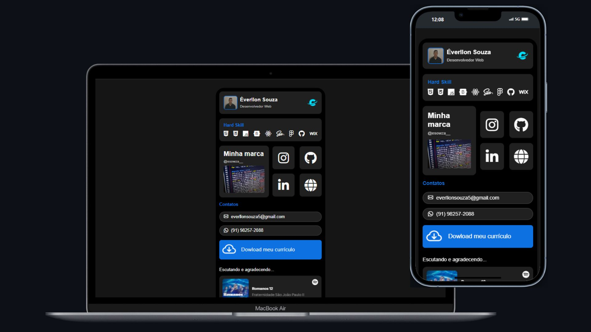

# Link Hub | Dev Éverllon
Apresento o meu Link Hub: uma solução prática e moderna para centralizar todos os seus links de redes sociais em um só lugar! Desenvolvido por mim, Éverllon Souza, este projeto foi pensado para destacar habilidades, projetos e informações importantes de forma elegante e funcional.

Com uma interface atrativa, o Link Hub inclui:
✅ Widgets personalizados com informações pessoais e competências técnicas.
✅ Links para redes sociais, portfólios e muito mais.

Ideal para quem deseja se conectar e mostrar o melhor de si de maneira profissional e organizada! 🚀





## Funcionalidades
- Centralizar links importantes
- Interface limpa e moderna
- Design intuitivo
- Formato atraente
- Profissionalismo

## Como Usar

1. **Acesse a página online:**  
   Clique no link para visualizar o site diretamente no navegador:  
   [**Link Hub - Preview**](https://deveverllon.github.io/link-bio/)

2. **Clone o repositório:**  
   Copie o repositório para sua máquina local usando o comando abaixo no terminal:  
   ```bash
   git clone https://github.com/deveverllon/link-bio.git

## Tecnologias utilizadas
- Linguagem de Marcação de Hipertexto _HTML
- Linguagem de Folhas Estilos em Cascata _CSS
- Linguagem de Programação Javascript
- FontAwesome para ícones
- Google Fonts
- Bootstrap

## Estrutura de Arquivos
```plaintext
/linkhub
|-- [index.html]
|-- [style.css]
|-- [script.js]
|-- /assets
    |-- document-download.pdf
    |-- smile-icon.png
    |-- tread-skateboard.jpg
    |-- user-profile.png
```

## Visualização

👉 Visite a página na web clicando em [**Preview**](https://deveverllon.github.io/link-bio/){:target="_blank"}.

Ou copie o link direto no navegador:  
`https://deveverllon.github.io/link-bio/`

